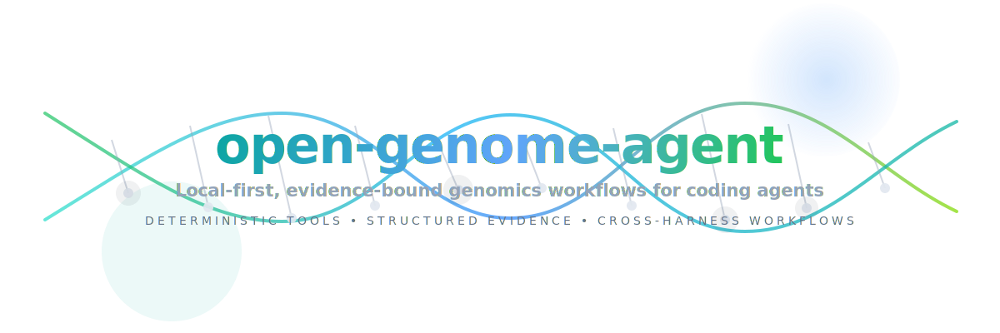
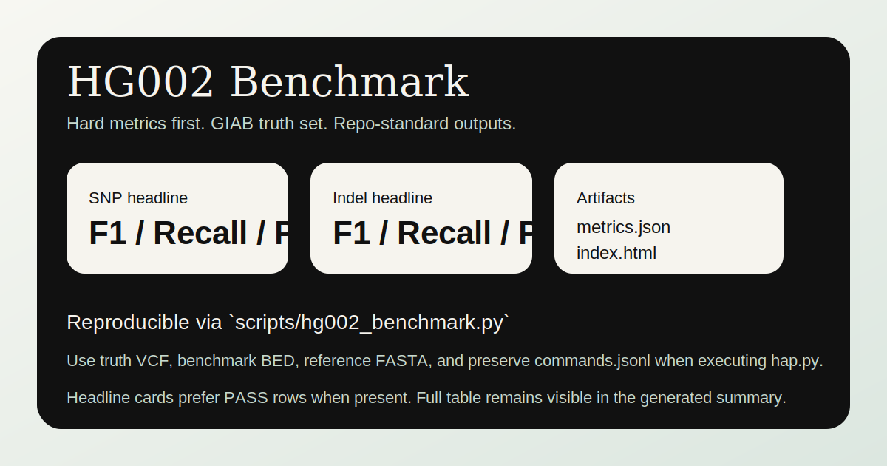
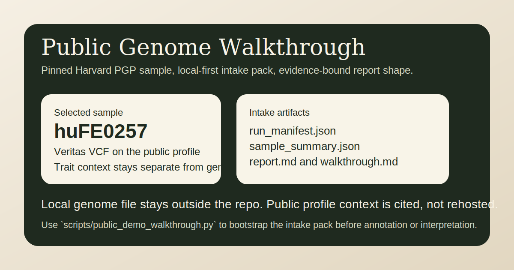

# open-genome-agent

<p align="center">
  
</p>

[](https://github.com/45ck/open-genome-agent/actions/workflows/ci.yml)
[](https://github.com/45ck/open-genome-agent/actions/workflows/codeql.yml)
[](LICENSE)

**Analyze DNA and VCFs locally with coding agents — and separate stronger signals, weaker signals, and things your genome cannot reliably tell you.**

`open-genome-agent` is a local-first DNA analysis copilot for VCF-first genomics workflows across:

- **Claude Code**
- **Codex CLI**
- future **MCP / SDK / app-server** harnesses

The design principle is simple:

> **LLM orchestrates. Deterministic bioinformatics tools compute. Structured evidence drives every claim.**

It is built for local-first DNA analysis, VCF review, variant interpretation, and conservative pharmacogenomics reporting.

## What this repo is for

This repo is for people who want a system that can help answer questions like:

- What known variants stand out in my data?
- Are there carrier-status findings worth noticing?
- Are there pharmacogenomic findings worth discussing with a clinician?
- What ancestry or lineage clues are visible?
- Which outputs are fairly strong, which are probabilistic, and which should be treated as weak hints only?

It should feel more like a **disciplined genomics and variant-interpretation research assistant** than a generic DNA-summary app.

## Confidence model at a glance

### Can often help with relatively stronger signals

- known or well-characterized variant lookups
- carrier-style findings
- some pharmacogenomic findings
- ancestry and lineage clues
- some simpler trait-linked variants

### May help with weaker, probabilistic signals

- polygenic risk scores
- trait tendencies
- performance or body predispositions
- exploratory leads that deserve follow-up, not blind trust

### Should not claim to tell you

- exact future outcomes
- exact disease certainty or timing
- exact personality, intelligence, or lifespan
- medication safety without clinician review

See [docs/confidence-model.md](docs/confidence-model.md) and [docs/what-we-do-not-claim.md](docs/what-we-do-not-claim.md).

## What this repo is not

This is **not** a doctor, **not** a diagnosis engine, and **not** a replacement for a genetic counselor or clinician.

If the system surfaces something high-impact, the right next step is **human review**.

## Status

This is a **repo scaffold / starter kit**, not a finished clinical pipeline.

Version 0.1 focuses on:

- a single source of truth for skills and agent definitions
- generated runtime folders for Claude and Codex
- schemas for manifests, findings, and evidence
- safety and reporting rules
- synthetic fixtures and build tests
- hook stubs and MCP server stubs

The current delivery direction is a **proof program**:

- benchmark correctness first on public truth data
- demonstrate end-to-end reporting on public genomes
- keep interpretation modules evidence-bound and separately evaluated
- preserve portability across Claude Code and Codex CLI

Current status:

- confirmed: scaffolds, manifests, wrappers, and synthetic tests for the proof stack are in-repo
- not yet confirmed: live public-data runs on `HG002`, `CMRG`, `huFE0257`, the selected `1000 Genomes` cohort, plus real `hap.py` and `Nextflow` execution on local inputs

See [ROADMAP.md](ROADMAP.md) for the active plan, [docs/README.md](docs/README.md) for the docs map, and `.beads/issues.jsonl` or `bd ready` for the active execution backlog.

## Proof Artifacts

The current proof stack is visible directly in the repo:

- baseline benchmark flow: [benchmarks/hg002/README.md](benchmarks/hg002/README.md)
- hard-region benchmark flow: [benchmarks/cmrg/README.md](benchmarks/cmrg/README.md)
- public genome walkthrough: [benchmarks/public-demos/README.md](benchmarks/public-demos/README.md)
- interpretation evaluation pack: [evals/interpretation/README.md](evals/interpretation/README.md)
- confidence model: [docs/confidence-model.md](docs/confidence-model.md)
- provenance transcript: [docs/cli-provenance-demo.md](docs/cli-provenance-demo.md)
- limitations panel: [docs/what-we-do-not-claim.md](docs/what-we-do-not-claim.md)

<p align="center">
  
  
</p>

## Project navigation

- roadmap: [ROADMAP.md](ROADMAP.md)
- docs index: [docs/README.md](docs/README.md)
- active execution backlog: `bd ready`, `bd show open-genome-agent-yqv`, or `.beads/issues.jsonl`
- historical backlog-shaping note: [DEMO_BACKLOG.md](DEMO_BACKLOG.md)

## Why this shape

The repo separates three concerns:

1. **User-facing confidence model** — what can be said strongly, probabilistically, or not at all
2. **Source definitions** — skill and agent specs that stay harness-agnostic
3. **Adapters** — generated runtime layouts for each coding harness

That lets you maintain one workflow definition and emit the files that each agent runner expects.

## Repository layout

```text
open-genome-agent/
  policy/           # shared operating rules and rubrics
  schemas/          # machine-readable output contracts
  benchmarks/       # benchmark and public-data proof-program assets
  evals/            # interpretation and reasoning evaluation packs
  docs/             # human-readable guides, confidence rules, and workflow notes
  skills-src/       # harness-agnostic skill source definitions
  agents-src/       # harness-agnostic agent source definitions
  adapters/         # Claude and Codex generators + templates
  .claude/          # generated Claude runtime files
  .agents/          # generated Codex skill runtime files
  .codex/           # generated Codex config + custom agents
  hooks/            # deterministic lifecycle hook scripts
  mcp/              # local-first MCP server stubs
  examples/         # synthetic demo data and reports
  tests/            # build + schema validation tests
```

## Quick start

### 1. Clone and create a virtualenv

```bash
python3 -m venv .venv
source .venv/bin/activate
python -m pip install --upgrade pip
python -m pip install -e ".[dev]"
```

### 2. Regenerate harness outputs

```bash
python scripts/build_all.py
```

That rebuilds:

- `CLAUDE.md`
- `AGENTS.md`
- `.claude/skills/*`
- `.claude/agents/*`
- `.claude/settings.json`
- `.agents/skills/*`
- `.codex/agents/*`
- `.codex/config.toml`
- `.codex/hooks.json`
- `adapters/*/dist/*`

### 3. Run tests

```bash
python -m unittest discover -s tests -p "test_*.py"
```

## Using with Claude Code

This repo already contains a project-scoped `.claude/` folder.

You can open the repository directly in Claude Code, or copy `adapters/claude/dist/.claude/` plus `CLAUDE.md` into another repo with:

```bash
python adapters/claude/install.py /path/to/target-repo
```

## Using with Codex CLI

This repo already contains project-scoped:

- `AGENTS.md`
- `.agents/skills/`
- `.codex/config.toml`
- `.codex/agents/`
- `.codex/hooks.json`

To copy that layout into another repository:

```bash
python adapters/codex/install.py /path/to/target-repo
```

## What the first milestone covers

The default workflow is **VCF-first**, not raw FASTQ-first.

Included starter skills:

- `setup-workstation`
- `ingest-vcf`
- `detect-build-normalize`
- `query-variants`
- `annotate-variants`
- `prioritize-findings`
- `pharmacogenomics`
- `polygenic-risk`
- `generate-report`
- `nextflow-runner`

Included starter agents:

- `orchestrator`
- `explorer`
- `qc-worker`
- `annotation-worker`
- `evidence-reviewer`
- `report-writer`
- `workflow-ops`

## Safety model

This scaffold is intentionally strict:

- raw inputs are read-only
- no default upload of genome data
- no medical diagnosis output
- no mixing of strong variant evidence with weak PRS-style output
- every finding must have provenance and caveats
- every report must separate:
  - high-confidence findings
  - probabilistic findings
  - exploratory leads
  - unknowns / limitations

See `docs/safety-model.md` and `policy/`.

## Open source baseline

This repository ships with:

- MIT licensing
- contribution and support docs
- a code of conduct
- security reporting guidance
- issue and pull request templates
- CI, dependency review, Dependabot, and CodeQL workflows

If you publish derivative workflows, keep the safety constraints, provenance expectations, and non-diagnostic framing intact.

## Near-term direction

The repo should prove capability in this order:

1. synthetic smoke tests for CI stability
2. HG002 benchmark mode for hard correctness metrics
3. CMRG mode for difficult medically relevant regions
4. one public-genome walkthrough on openly shared data
5. interpretation evaluation packs with explicit confidence and evidence rules

The plan lives in [ROADMAP.md](ROADMAP.md). The active execution backlog lives in Beads and is exported to `.beads/issues.jsonl`.

## License

MIT

See `LICENSE`, `SECURITY.md`, `CODE_OF_CONDUCT.md`, `CONTRIBUTING.md`, and `SUPPORT.md` for repository governance details.
